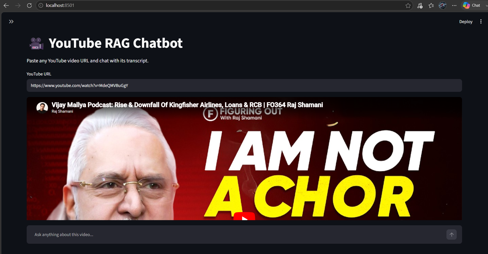
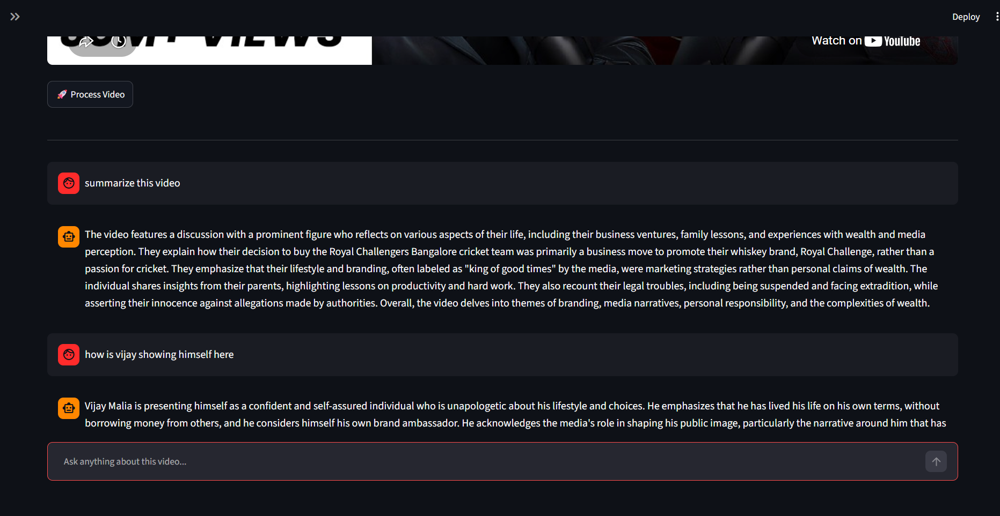

# 🎥 YouTube RAG Chatbot

A beginner Retrieval-Augmented Generation (RAG) application built using LangChain.

## Features

- Paste any YouTube video URL
- Automatically fetch the transcript
- Split transcript into chunks
- Generate embeddings using OpenAI
- Store embeddings in FAISS
- Ask questions about the video using GPT-4o Mini
- Interactive Streamlit UI

## Tech Stack

- Python
- LangChain
- OpenAI
- FAISS
- Streamlit
- YouTube Transcript API

## Project Structure

```
12.RAGAPPLICATION/
│── app.py
│── rag.py
│── README.md
│── requirements.txt
│── .env.example
```

## Installation

```bash
pip install -r requirements.txt
```

Create a `.env` file:

```env
OPENAI_API_KEY=your_api_key
```

Run the application:

```bash
streamlit run app.py
```

## Future Improvements

- PDF RAG
- Website RAG
- Hybrid Search
- Reranking
- Multi-document RAG
- Agentic RAG

## 📸 Screenshots

### Home Page



### Chat Interface


